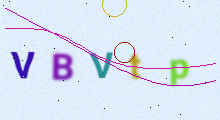
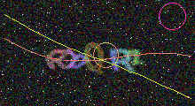

[](https://github.com/egeapak/captchapi/actions/workflows/ci.yml)
[](https://opensource.org/licenses/Apache-2.0)
[](https://www.rust-lang.org)

# CaptchAPI

A secure, high-performance REST API for CAPTCHA generation and validation. Built with Rust, featuring async/await architecture, SQLite persistence, and distroless Docker containers.

CAPTCHA images are rendered in-process with configurable difficulty and dark mode support:

| Easy (difficulty 2) | Hard + dark mode (difficulty 8) |
|:---:|:---:|
|  |  |

## Table of Contents

- [Features](#features)
- [Quick Start](#quick-start)
- [Docker Deployment](#docker-deployment)
- [Usage](#usage)
- [Configuration](#configuration)
- [API Reference](#api-reference)
- [Development](#development)
- [Contributing](#contributing)
- [License](#license)

## Features

- **Security First**
  - API key authentication with SHA256 hashing
  - Nonroot Docker containers (UID 65532)
  - Distroless base image with minimal attack surface
  - Automatic session expiration and cleanup
  - Configurable validation attempt limits

- **High Performance**
  - Async/await throughout (Tokio + Axum)
  - In-process SQLite (zero network overhead)
  - Connection pooling (max 5 concurrent)
  - Low memory footprint

- **Developer Friendly**
  - Full REST API with JSON responses
  - Configurable CAPTCHA length, difficulty (1-10), dimensions, and compression
  - Defaults chosen by measured solve rate, not by feel — see [Tuning](#tuning-length-and-difficulty)
  - Dark mode support
  - Complete API documentation
  - Command-line interface with `config show` / `config check` for deployment pipelines

- **Operable**
  - Layered configuration: command line, environment, env file, TOML file
  - Runtime reload of session TTLs, attempt limits and image quality — via SIGHUP,
    `captchapi reload`, or the admin API — with no restart and no dropped sessions
  - Secrets read from files, never from flags, and never echoed back by the API

- **Production Ready**
  - Multi-platform Docker images (amd64 + arm64)
  - Three deployment modes (transient, volume, bind mount)
  - Structured logging with tracing
  - OpenTelemetry integration (optional)
  - Per-IP rate limiting (GCRA algorithm)
  - Background session cleanup

## Quick Start

### Prerequisites

- **Rust 1.94+** and Cargo (see `rust-version` in `Cargo.toml`)
- **SQLite** support (usually built-in)

### Setup

```bash
# Clone and enter the project
git clone https://github.com/egeapak/captchapi
cd captchapi

# Copy environment template
cp .env.example .env

# Generate secure keys (recommended)
# API_KEY_SALT=$(openssl rand -base64 32)
# MASTER_API_KEY=$(openssl rand -base64 32)
# Update these values in .env

# Run the application
cargo run

# Verify it's running
curl http://localhost:3000/health
```

The server will start on `http://localhost:3000` with automatic database initialization.

## Docker Deployment

### Pre-built Image

Multi-platform images (amd64 + arm64) are published to GitHub Container Registry:

```bash
docker pull ghcr.io/egeapak/captchapi:latest

# Pin a version instead
docker pull ghcr.io/egeapak/captchapi:1.0.1

# Same binary on `scratch` — 22% smaller to pull, no tzdata or CA bundle
docker pull ghcr.io/egeapak/captchapi:scratch-latest
```

See [docker/README.md](docker/README.md) for the full tag list, measured image sizes and how to
verify the build provenance attestation.

```bash
# Transient (no volume)
docker run -p 3000:3000 \
  -e API_KEY_SALT=your-salt-minimum-16chars \
  -e MASTER_API_KEY=your-key-minimum-16chars \
  ghcr.io/egeapak/captchapi:latest

# Production (with volume)
docker volume create captchapi-data
docker run -p 3000:3000 \
  -v captchapi-data:/data \
  -e API_KEY_SALT=your-salt-minimum-16chars \
  -e MASTER_API_KEY=your-key-minimum-16chars \
  ghcr.io/egeapak/captchapi:latest
```

### Building from Source

**Prerequisites:** [cross](https://github.com/cross-rs/cross) and [just](https://github.com/casey/just)

```bash
# Build optimized static image
just

# Run transient (testing)
just run

# Run with persistent volume (production)
just run-volume
```

See [`docker/README.md`](docker/README.md) for detailed build documentation and bind mount instructions.

## Usage

### 1. Create an API Key (one-time setup)

```bash
curl -X POST http://localhost:3000/api/v1/api-keys \
  -H "Authorization: Bearer YOUR_MASTER_API_KEY" \
  -H "Content-Type: application/json" \
  -d '{"description": "Frontend Application"}'
```

Save the returned `api_key` value — it's only shown once.

### 2. Create a CAPTCHA Session

```bash
curl -X POST http://localhost:3000/api/v1/sessions \
  -H "Authorization: Bearer YOUR_API_KEY" \
  -H "Content-Type: application/json" \
  -d '{"length": 6, "difficulty": 5, "expires_in_seconds": 300}'
```

### 3. Display the CAPTCHA Image

```html

```

### 4. Validate User's Solution

```bash
curl -X POST http://localhost:3000/api/v1/sessions/{session_id}/validate \
  -H "Authorization: Bearer YOUR_API_KEY" \
  -H "Content-Type: application/json" \
  -d '{"solution": "aBc5Xq"}'
```

- Validation is **case-sensitive**: `aBc5Xq` ≠ `abc5xq`
- Session is **auto-deleted** after successful validation

### Tuning length and difficulty

The defaults are `length: 6`, `difficulty: 5`. Both were set by measuring how
often frontier vision models actually solve the images this service serves —
Opus 5 and Sonnet 5, given the character set, the exact solution length, a
description of every deformation, and (for the tool-equipped arms) python, Pillow,
numpy and the bundled font to template-match against. That is a maximally
advantaged attacker, which is the right one to design against.

**Length is the sharper knob, and it is not close.** Pooled over difficulty 5-8
and every arm:

| length | solved | per-character accuracy |
|---|---|---|
| 4 | 8/40 = 20% | 58% |
| 5 | 8/40 = 20% | 64% |
| **6 (default)** | **0/40 = 0%** — 95% CI [0%, 8.8%] | 44% |

The mechanism is arithmetic: solving requires *every* character, so the solve rate
is roughly the per-character accuracy raised to the length. At 44-64% per
character, `0.64^5` is about 11% and `0.44^6` is under 1%. Each extra character
multiplies the attacker's problem.

**Difficulty is the blunter knob**, and past the default it mostly costs
legibility:

| level | solved | per-character accuracy |
|---|---|---|
| 5 (default) | 7/84 = 8.3% — 95% CI [4.1%, 16.2%] | 66% |
| 6 | 6/24 = 25% | 63% |
| 7 | 2/24 = 8.3% | 38% |
| 8 | 1/24 = 4.2% | 37% |

Read the character column, not the solve column — the solve counts rest on 24
attempts per level and are not even monotonic, while the character rate rests on
120 per level and falls cleanly. Levels 5 and 8 have almost completely overlapping
intervals, so choosing 8 buys an unmeasurable amount of safety for **20% more
render time and 20% more stored bytes**, and images a human finds materially
harder.

**Practical guidance:**

| you want | do this |
|---|---|
| more resistance | raise `length` to 7+ before touching `difficulty` |
| accessibility | drop `difficulty` to 2-3; those levels stay clearly legible |
| smaller images | lower `difficulty`, not `length` — noise dominates the encoded size |
| a short input field | lower `length`, and accept the measured cost above |

**What holds the rate is the rendering.** Ten deformations are drawn
independently *per letter* — jitter, scale, skew, wave, rotation, clustering,
outline, transparency, gradient and blur — so no single rule describes a whole
solution. Two of them specifically defeated the image-processing attack that used
to work: `gradient` ramps hue across a single letter and the blur is applied
*after* compositing, so it smears each letter into its neighbour. Hue-band
splitting no longer isolates a glyph, and a tooled solver now does no better than
one that simply looks (paired per image, p = 1.0, at 5-6x the token cost).

**Caveats worth stating.** These figures rest on tens of attempts, not thousands;
treat directions as reliable and magnitudes as indicative. `0/40` is an upper
bound of 8.8%, not a guarantee of zero. And every arm recovers 44-66% of
individual characters, so many failures are near-misses that case-sensitive
validation converts into failed solves — the margin is thinner than the solve rate
suggests. Full measurements, methodology and reproduction steps are in
`.claude/CLAUDE.md`.
- After **3 failed attempts**, the session is automatically deleted

### Error Handling

All errors return JSON with a standardized format:

```json
{
  "error": "session_not_found",
  "message": "Session not found or has expired"
}
```

| Code | HTTP Status | Description |
|------|-------------|-------------|
| `unauthorized` | 401 | Invalid or missing API key |
| `session_not_found` | 404 | Session doesn't exist or expired |
| `invalid_parameters` | 400 | Bad request parameters |
| `internal_error` | 500 | Server error |

### Admin Operations

Admin endpoints require the master API key.

```bash
# List all API keys
curl http://localhost:3000/api/v1/api-keys \
  -H "Authorization: Bearer YOUR_MASTER_API_KEY"

# Deactivate a key
curl -X PUT http://localhost:3000/api/v1/api-keys/{key_hash} \
  -H "Authorization: Bearer YOUR_MASTER_API_KEY" \
  -H "Content-Type: application/json" \
  -d '{"is_active": false}'

# Delete a key
curl -X DELETE http://localhost:3000/api/v1/api-keys/{key_hash} \
  -H "Authorization: Bearer YOUR_MASTER_API_KEY"

# Manual cleanup of expired sessions
curl -X POST http://localhost:3000/api/v1/admin/cleanup \
  -H "Authorization: Bearer YOUR_MASTER_API_KEY"
```

## Configuration

Settings can come from the command line, the environment, an env file, or a TOML config file.
Later sources lose to earlier ones:

```
command line  >  environment  >  env file (.env)  >  config file  >  built-in default
```

An environment-only deployment keeps working exactly as before — every variable below is
unchanged. Create a `.env` file based on `.env.example`, or a config file based on
`captchapi.toml.example`.

To see what the server will actually do, and where each value came from:

```bash
captchapi config show
# server_port             = 8080                  [cli]
# database_url            = sqlite:./data/x.db    [env]
# captcha_compression     = 75                    [file: captchapi.toml]
# max_validation_attempts = 3                     [default]
# api_key_salt            = <redacted, 32 bytes>  [env]
```

### Command line

```
captchapi [OPTIONS]                    Start the server
captchapi config show [OPTIONS]        Print the effective configuration
captchapi config check [OPTIONS]       Validate the configuration and exit
captchapi reload [--pid N]             Tell a running server to reload
captchapi --help                       Full flag list
```

Every setting has a flag named after its variable — `--port`, `--captcha-compression`,
`--rate-limit-rps` — plus `-c/--config`, `--env-file` and `--no-env-file`. Exit codes are `0`
for success, `1` for a runtime error and `2` for a usage or configuration error, so
`config check` works in a deployment pipeline.

### Secrets

The two secrets are never accepted as flag *values* — that would put them in `ps`, shell
history and `docker inspect`. Pass a file instead, which is also what Docker and Kubernetes
secrets provide:

```bash
captchapi --api-key-salt-file   /run/secrets/salt \
          --master-api-key-file /run/secrets/master_key
```

They also cannot be set in the TOML config file at all, so a config file is safe to commit.

### Reloading

Session TTLs, the attempt limit, the JPEG quality and the cleanup interval can be changed
without a restart:

```bash
$EDITOR captchapi.toml
captchapi reload                     # or: kill -HUP $(cat data/captchapi.pid)
docker kill -s HUP <container>       # same thing inside the image
```

A value set through `PATCH /api/v1/admin/config` outranks every other layer, including the
command line, until the next reload clears it.

Everything else — the bind address, the database, the API key salt, the master key and the rate
limits — is captured at startup by the listener, the connection pool, the middleware and the
rate limiter. A reload reports any of those that changed and tells you a restart is needed,
rather than silently ignoring them. A reload that fails to resolve is logged and discarded; the
running server keeps its current configuration.

The same operations are available over HTTP — see [Admin endpoints](docs/API.md#admin-endpoints).

### Server

| Variable | Flag | Description | Default | Required |
|----------|------|-------------|---------|----------|
| `SERVER_HOST` | `-H`, `--host` | Bind address | `0.0.0.0` | No |
| `SERVER_PORT` | `-p`, `--port` | Listen port | `3000` | No |
| `PID_FILE` | `--pid-file` | Where to write the process ID for `captchapi reload` | `./data/captchapi.pid` | No |

### Database

| Variable | Flag | Description | Default | Required |
|----------|------|-------------|---------|----------|
| `DATABASE_URL` | `-d`, `--database-url` | SQLite connection string | `sqlite:./data/captchapi.db` | No |
| `DATABASE_MAX_CONNECTIONS` | `--database-max-connections` | Connection pool size | `5` | No |

### Security

| Variable | Flag | Description | Default | Required |
|----------|------|-------------|---------|----------|
| `API_KEY_SALT` | `--api-key-salt-file` | Salt for API key hashing (min 16 chars) | - | **Yes** |
| `MASTER_API_KEY` | `--master-api-key-file` | Admin API key (min 16 chars) | - | **Yes** |
| `SOLUTION_HASH_SECRET` | `--solution-hash-secret-file` | Key for hashing CAPTCHA solutions (min 16 chars) | `API_KEY_SALT` | No |
| `IMAGE_ENCRYPTION_SECRET` | `--image-encryption-secret-file` | Key for encrypting stored CAPTCHA images (min 16 chars) | `API_KEY_SALT` | No |

The flags take a *path*, not the secret itself. None of these can be set in the TOML config
file, and all four are redacted by `config show` and the admin API.

> **Rotating `SOLUTION_HASH_SECRET` or `IMAGE_ENCRYPTION_SECRET` invalidates every stored
> session** — existing solution hashes stop matching and stored images stop decrypting. Like
> `API_KEY_SALT`, they are applied at startup only; a reload reports a change rather than
> applying it.

### CAPTCHA

All four are reloadable — a reload applies them without a restart.

| Variable | Flag | Description | Default | Required |
|----------|------|-------------|---------|----------|
| `DEFAULT_SESSION_TTL_SECONDS` | `--default-session-ttl` | Default session expiration | `300` | No |
| `MAX_SESSION_TTL_SECONDS` | `--max-session-ttl` | Maximum allowed TTL | `3600` | No |
| `MAX_VALIDATION_ATTEMPTS` | `--max-validation-attempts` | Failed attempts before deletion | `3` | No |
| `CAPTCHA_COMPRESSION` | `--captcha-compression` | JPEG quality (1-100) | `40` | No |

### Rate Limiting

| Variable | Flag | Description | Default | Required |
|----------|------|-------------|---------|----------|
| `RATE_LIMIT_REQUESTS_PER_SECOND` | `--rate-limit-rps` | Sustained request rate per IP | `2` | No |
| `RATE_LIMIT_BURST_SIZE` | `--rate-limit-burst` | Burst capacity per IP | `10` | No |
| `RATE_LIMIT_REVERSE_PROXY` | `--rate-limit-reverse-proxy` | Read client IP from proxy headers | `false` | No |

> **Warning:** Only enable `RATE_LIMIT_REVERSE_PROXY` if you trust your proxy — clients can spoof headers otherwise.

### Background Tasks

| Variable | Flag | Description | Default | Required |
|----------|------|-------------|---------|----------|
| `CLEANUP_INTERVAL_SECONDS` | `--cleanup-interval` | Expired session cleanup interval (reloadable) | `60` | No |

### OpenTelemetry (optional)

OpenTelemetry trace export sits behind the `otel` cargo feature, because the
OTLP exporter pulls in a full HTTP client worth roughly 700 KB of binary:

```bash
cargo build --release --features otel
```

**The published Docker images are built with `otel` enabled**, so the settings
below work out of the box there. A plain `cargo build` does not include it;
such a binary warns on startup if telemetry is enabled in the configuration,
rather than ignoring it silently. Prometheus-style metrics are unaffected and
always available in every build.

| Variable | Flag | Description | Default | Required |
|----------|------|-------------|---------|----------|
| `OTEL_ENABLED` | `--otel` | Enable OpenTelemetry tracing (requires the `otel` feature) | `false` | No |
| `OTEL_EXPORTER_OTLP_ENDPOINT` | `--otel-endpoint` | OTLP HTTP endpoint | `http://localhost:4318` | No |
| `OTEL_SERVICE_NAME` | `--otel-service-name` | Service name for traces | `captchapi` | No |

### Logging

| Variable | Flag | Description | Default | Required |
|----------|------|-------------|---------|----------|
| `RUST_LOG` | `--log-level` | Tracing filter directives | `captchapi=debug,tower_http=debug` | No |

Directives are `target=level` pairs or a bare level, comma separated — for
example `captchapi=info,tower_http=warn` or just `debug`. Per-span field
filtering (`[span{field=value}]=level`) is not supported; the filter is built
on `tracing_subscriber::filter::Targets` rather than `EnvFilter` to keep the
`regex` engine out of the binary.

### Admin

| Variable | Flag | Description | Default | Required |
|----------|------|-------------|---------|----------|
| `ADMIN_CONFIG_WRITE` | `--admin-config-write` | Allow `PATCH /api/v1/admin/config` to change settings at runtime | `true` | No |

Set `ADMIN_CONFIG_WRITE=false` (or `--admin-config-write=false`) for deployments that want
file-driven reload but no remote mutation: `GET /admin/config` and `POST /admin/config/reload`
keep working, and `PATCH` returns `403`.

## API Reference

For the complete API documentation including all endpoints, request/response formats, and usage examples, see [`docs/API.md`](docs/API.md).

### Endpoints Overview

| Method | Endpoint | Auth | Description |
|--------|----------|------|-------------|
| `GET` | `/health` | None | Health check |
| `POST` | `/api/v1/sessions` | API Key | Create CAPTCHA session |
| `GET` | `/api/v1/sessions/{id}` | None | Get session details |
| `GET` | `/api/v1/sessions/{id}/image.jpeg` | None | Get CAPTCHA image |
| `POST` | `/api/v1/sessions/{id}/validate` | API Key | Validate solution |
| `DELETE` | `/api/v1/sessions/{id}` | API Key | Delete session |
| `POST` | `/api/v1/api-keys` | Master | Create API key |
| `GET` | `/api/v1/api-keys` | Master | List API keys |
| `PUT` | `/api/v1/api-keys/{hash}` | Master | Update API key |
| `DELETE` | `/api/v1/api-keys/{hash}` | Master | Delete API key |
| `POST` | `/api/v1/admin/cleanup` | Master | Manual cleanup |
| `GET` | `/api/v1/admin/config` | Master | Show effective configuration |
| `PATCH` | `/api/v1/admin/config` | Master | Change reloadable settings at runtime |
| `POST` | `/api/v1/admin/config/reload` | Master | Re-read every configuration source |

## Development

### Building

```bash
cargo build           # Debug build
cargo build --release # Release build
```

### Testing

This project uses [cargo-nextest](https://nexte.st/) for process-per-test isolation.

```bash
# Run all tests
cargo nextest run

# Unit tests only
cargo nextest run --lib

# Integration tests only
cargo nextest run --test sessions_test
```

**API Tests** (requires running server):

```bash
# Terminal 1
cargo run

# Terminal 2
./.bruno/Tests/Scripts/test-bruno-full.sh
```

### Code Quality

After every code change, run these commands **in order**:

```bash
cargo fmt          # Format code
cargo clippy       # Run linter
cargo check        # Check compilation
cargo nextest run  # Run tests
```

All steps must pass before committing.

## Contributing

Please see [CONTRIBUTING.md](CONTRIBUTING.md) for development setup, testing, and pull request guidelines.

## License

This project is licensed under the [Apache-2.0 License](LICENSE).
